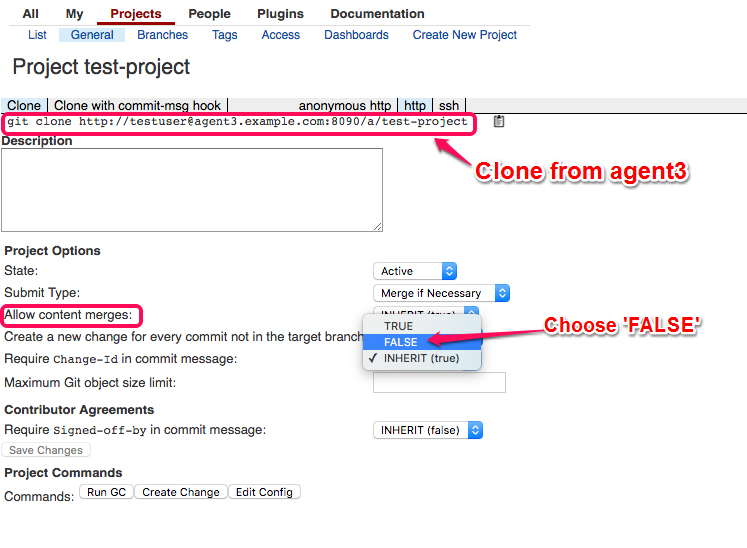

# Rhoynar-DevOps-Automation

## Vagrant with puppet node provisioning using shell script and puppet modules for  Gerrit, Zuul, Jenkins and JIRA.


  *Tested with Linux (Debian Jessie)*

**Prerequisite:**
### [Vagrant](https://www.vagrantup.com/downloads.html) >= 1.8.5

Download URL's:
- For [Mac](http://download.virtualbox.org/virtualbox/5.1.2/VirtualBox-5.1.2-108956-OSX.dmg)
- For [windows](http://download.virtualbox.org/virtualbox/5.1.2/VirtualBox-5.1.2-108956-Win.exe)

### [Virual Box](https://www.virtualbox.org/wiki/Downloads) >= 5.1.2

Download URL's:
- For [Mac](https://releases.hashicorp.com/vagrant/1.8.5/vagrant_1.8.5.dmg)
- For [windows](https://releases.hashicorp.com/vagrant/1.8.5/vagrant_1.8.5.msi)

### Provision Three Machines

Here we are provisioning **five** virtual machines into virtual box using vagrant, follow the below instructions to provisioning.
* Chnage directory where *Vagrantfile* is placed.
* Ensure that both *puppet-master.sh* and *puppet-agent.sh* is present in same location.

Make the below  necessary changes in Vagranfile (if required e.g if you want to change ip addresses for nodes)

##### 1. For Master VM:

```
config.vm.define "master" do |master|
master.vm.network "private_network", ip: "192.168.35.1"
master.vm.provision "shell", path: "puppet-master.sh", args: "-m 'master' -H '192.168.35.1' -a 'agent' -h '192.168.35.2 192.168.35.3 192.168.35.4 192.168.35.5'"
```

**Description:**
- -m : master host name.
- -h : master host IP.
- -a : agent nodes (Required for autosign certificate)

##### 2. For Agent VM

```
config.vm.define "agent1" do |agent1|
agent1.vm.network "private_network", ip: "192.168.35.2"
agent1.vm.provision "shell", path: "puppet-agent.sh", args: "-m 'master' -H '192.168.35.1' -a 'agent' -h '192.168.35.2 192.168.35.3 192.168.35.4 192.168.35.5' -i 'agent1'"
end
```

Repeat the same steps in other agents by replacing the agent name.

### Scripts

- [puppet-master.sh][master] : for puppet master installation and configuration while provisioning VM.
- [puppet-agent.sh][agent]   : for puppet agent installation and configuration while provisioning.

[master]: https://raw.githubusercontent.com/sagarinitcron/rhoynar-devops-automation/master/rhoynar-provision-puppetsetup/master-ss.sh
[agent]: https://raw.githubusercontent.com/sagarinitcron/rhoynar-devops-automation/master/rhoynar-provision-puppetsetup/agent-ss.sh

### How to run:

Use below command for provision VMs in single shot  with vagrant (first time it will take time because it will need to download the linux box).

```
	vagrant up
```

Once it is finished successfully, check the status using below command

```
	vagrant global-status
```

Now we can login the VM, using below command

```
	vagrant ssh master
```

we can provide VM id otherwise VM name while login to instance


### Now we will turn to puppet

In puppet we need to make main site.pp into "/etc/puppet/manifiest/site.pp", which will consider module distribution by agent, look into below code for sample.Visit this [link](https://raw.githubusercontent.com/sagarinitcron/rhoynar-devops-automation/master/) to check the complete code.

```

node 'agent1.example.com'{
include gerrit

class { 'jenkins::slave':
   		 masterurl => 'http://agent3.example.com:8080',
   		 ui_user => 'adminuser',
   		 ui_pass => 'adminpass',
		}
}

node 'agent2.example.com'{
	include jenkins
	include jenkins::master
}
```

### Overview

Let us have an overview of our instances,

|Instance|Name|Purpose|Private IP's|
|:---:|:---:|:---:|:---:|
|1|Master|Puppet Master will be Installed|192.168.35.1|
|2|Agent1|Jira|192.168.35.2|
|3|Agent2|Jenkins|192.168.35.3|
|4|Agent3|Gerrit|192.168.35.4|
|5|Agent4|Zuul|192.168.35.5|

---

# MODULES

Let us explore each modules for detailed understanding,

## JIRA

As per our puppet module JIRA will be installed on *Agent1*

* Once puppet agent installs JIRA vist the url on port 8080 [*192.168.35.2:8080*](https://192.168.35.2:8080)

Setup JIRA by using the simple GUI as follows

* Choose Application name and Mode

  

* Choose how do you want to use JIRA

  

* Specify your JIRA License Key

  

* Setup Administrator account

  

* Configure Email id, Avatar and finish installation with basic intro to JIRA. Once you're done with everything you can see JIRA dashboard.

  

* Now let us add JIRA CLI Add-ons for interacting with JIRA using CLI, click gear icon on top right corner to add Add-ons.

  

* From the list of available Add-ons choose `JIRA Command Line Interface (CLI)` which is Atlassian Verified, to install it.

  

---
## Jenkins master and slave

Puppet Module will install Jenkins on Agent2, visit the instance IP with port 8080 to configure Jenkins [*192.168.35.2:8080*](https://192.168.35.2:8080)

* Initiall password will be automatically generated in the following location */var/lib/jenkins/secrets/initialAdminPassword*

* Login to the instance and copy paste the password.

  

* Proceed with installing the basic required plugins for Jenkins.

* Manually Setup new administrator *username* and *password* for administrator account.

  

* Now Jenkins is ready.

  

* Let us make connection with Gearman for interaction. Configure Gearman server IP and Listening port to establish connection with Gearman.

  

* After successful connection to Gearman with Jenkins we could see the list of Jobs created automatically in Jenkins Dashboard.

  

---

## Gerrit

Gerrit is a code review tool which will be installed in Agent3 by puppet module.

* Visit the Gerrit IP with port 8090 to configure Gerrit by registering or signing in.

  

* Sign in to Gerrit with the existing account.

  

* After successful sign in we can edit settings.

  

* Under `profile` select username to setup.

  

  and confirm the username by selecting `OK`.

  

* Add a SSH public key to Gerrit under `SSH Public Keys`

  

* Generate HTTP Password for the user that we created under `HTTP Password` settings

  

* Create a new project under `Projects` section.

  

* Clone `test-project` from agent3 for testuser and choose `FALSE` for `Allow content merges`

  

---

## Zuul

Puppet module will install Zuul in Agent4. Zuul is a pipeline oriented project gating and automation system.

After installation visit the IP for Zuul Dashboard.


---

# SITE.PP

Let us dig deep in each resource of site.pp

## Agent1 - JIRA

In this resource part the *Jira class* for installing JIRA and *postgresql class* for db server is configured along with username and password.


---

## Agent2 - Jenkins

In agent2 resource part Jenkins modules are included along with credentials of JIRA for integration as follows,


---

## Agent3 - Gerrit

Gerrit class is included in agent3 resource part with jenkins slave configuration for integration as shown below,


---

## Agent4 - Zuul

Resource part for agent4 includes Zuul with the following specifications for proper integration,


---

## Git-Review

We use `git-review` tool for submitting git branches to gerrit for review.

### Installation

We use `pip` to install `git-review`

```
pip install git-review
```

### Setup

By default, git-review will look for a remote named ‘gerrit’ for working with Gerrit. If the remote exists, git-review will submit the current branch to HEAD:refs/for/master at that remote.

If the Gerrit remote does not exist, git-review looks for a file called .gitreview at the root of the repository with information about the gerrit remote. Assuming that file is present, git-review should be able to automatically configure your repository the first time it is run.

The name of the Gerrit remote is configurable; see the configuration section below.

### .gitreview configuration file

Example .gitreview file (used to upload for git-review itself):

```
[gerrit]
host=review.openstack.org
port=29418
project=openstack-infra/git-review.git
defaultbranch=master
```

**Note:**

Required values: host, project

Optional values: port (default: 29418), defaultbranch (default: master), defaultremote (default: gerrit).

*For more detailed informaton visit [`openstack-docs`](http://docs.openstack.org/infra/git-review/)*
